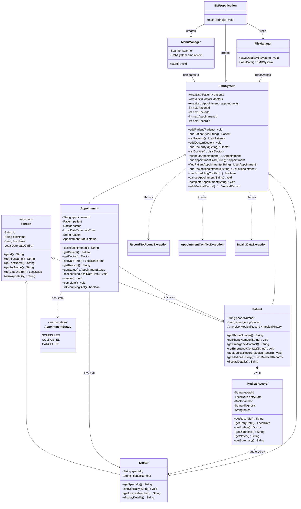

# EMR System — UML Class Diagram

Approved class design for the Simplified EMR console project (class version). It matches the Simplified EMR Project Outline. If the two ever disagree, the outline wins.

## Notation

- `-` private, `+` public
- `*` after a method = abstract (no body in this class; subclasses must override)
- `$` after a method = static
- `~Type~` = generic type, e.g. `ArrayList~Patient~` means `ArrayList<Patient>`
- Constructors are not listed; each class has one that initializes and validates its fields.
- `(...)` = parameters still to be decided when the method is planned.

| Arrow | Meaning | Example |
|---|---|---|
| `<\|--` | Inheritance ("is a") | Patient is a Person |
| `*--` | Composition (owns; parts belong to the whole) | Patient owns its MedicalRecords |
| `o--` | Aggregation (holds a collection of) | EMRSystem holds Patients, Doctors, Appointments |
| `-->` | Association (refers to) | Appointment refers to a Patient and a Doctor |
| `..>` | Dependency (uses / throws) | EMRSystem throws RecordNotFoundException |

## Diagram

## Package placement

| Package | Classes |
|---|---|
| `aljafemr` | EMRApplication |
| `aljafemr.model` | Person, Patient, Doctor, Appointment, AppointmentStatus, MedicalRecord |
| `aljafemr.application` | EMRSystem |
| `aljafemr.ui` | MenuManager |
| `aljafemr.storage` | FileManager |
| `aljafemr.exception` | RecordNotFoundException, AppointmentConflictException, InvalidDataException |

## Design notes

- **Why `Person` is abstract.** A plain `Person` is never created, only a `Patient` or `Doctor`. `displayDetails()` has no body in `Person`, and each subclass overrides it. Calling it through a `Person` reference is the project's polymorphism evidence.
- **Composition vs. association.** A `Patient` owns its medical history: records exist only as part of that patient. An `Appointment` only refers to a `Patient` and `Doctor` that already exist independently. It doesn't own them.
- **EMRSystem's boundary.** The three `ArrayList`s live only inside `EMRSystem`. `MenuManager` never touches them directly and always calls an `EMRSystem` method. List-returning methods return a safe copy or read-only view, never the internal list itself.
- **Status changes.** `Appointment` has no public `setStatus()`. The status changes only through `reschedule()`, `cancel()`, and `complete()`, which reject invalid transitions. Only `SCHEDULED` appointments block a doctor's time slot.
- **Dependencies, not fields.** `FileManager` reads and writes `EMRSystem` data without owning it. `EMRSystem` throws the three exceptions but doesn't store them.
- **Exception base type.** Custom exceptions will extend `Exception` (checked), so that errors at compile time will be caught and handled to prevent the program from crashing.  
